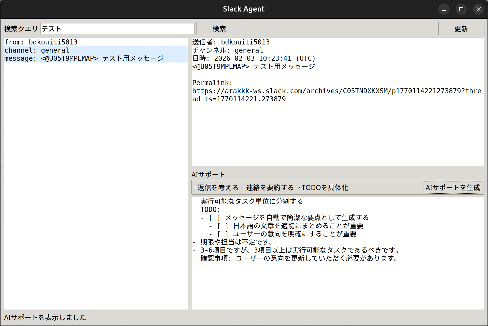

# Slack Agent

Slackのスレッドに対して、AIサポートを提供するデスクトップアプリです。  
Tkinter製で、OpenAI / Azure OpenAI / Ollama に対応します。



## 対応OS
- Windows
- Linux

## できること
- 検索クエリに一致するSlackメッセージを最大10件表示
- メッセージの詳細とスレッドを取得
- 返信案の作成
- 連絡内容の要約
- TODOの具体化

## 必要なもの
- Slackのユーザートークン（`xoxp-` から始まるトークン）
- AIプロバイダの設定（OpenAI / Azure OpenAI / Ollama のいずれか）

## クイックスタート（実行ファイル）
1. `config/config.yml.sample` を `config/config.yml` に変更し、必要情報を入力します。
2. 実行ファイルを起動します。Linuxは `slack-agent-linux`、Windowsは `slack-agent-windows.exe` です。

## 設定方法
1. 依存関係をインストールします（ソースから起動する場合）。

```bash
pip install -r requirements.txt
```

2. 設定ファイルを作成します。

```bash
cp config/config.yml.sample config/config.yml
```

3. `config/config.yml` を編集します。

```yaml
slack:
  user_token: "xoxp-..."
  token: ""
  search_query: "from:me"

ai:
  provider: "ollama" # openai / azure_openai / ollama

openai:
  api_key: ""
  model: "gpt-4o-mini"

azure_openai:
  api_key: ""
  endpoint: ""
  deployment: ""
  api_version: ""

ollama:
  base_url: "http://localhost:11434"
  model: "llama3.1"
```

4. 必要に応じて環境変数で上書きできます。

- `SLACK_AGENT_CONFIG`（設定ファイルのパス）
- `SLACK_USER_TOKEN` / `SLACK_TOKEN` / `SLACK_SEARCH_QUERY`
- `AI_PROVIDER`
- `OPENAI_API_KEY` / `OPENAI_MODEL`
- `AZURE_OPENAI_API_KEY` / `AZURE_OPENAI_ENDPOINT` / `AZURE_OPENAI_DEPLOYMENT` / `AZURE_OPENAI_API_VERSION`
- `OLLAMA_BASE_URL` / `OLLAMA_MODEL`

注意: Slackトークンは機密情報のため、共有や配布時の取り扱いに注意してください。

## 使い方
1. アプリを起動します。

ソースから起動する場合:
```bash
python app.py
```

2. 画面上部の検索クエリを入力し、`検索` をクリックします。
3. 左のリストからメッセージを選択します。
4. `返信を考える` / `連絡を要約する` / `TODOを具体化` を選び、`AIサポートを生成` をクリックします。

補足: 実行ファイル版を使う場合は、実行ファイルと同じ階層に `config/config.yml` を配置してください。
